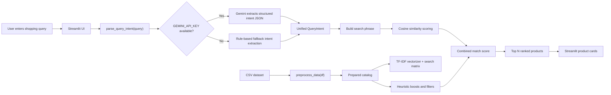
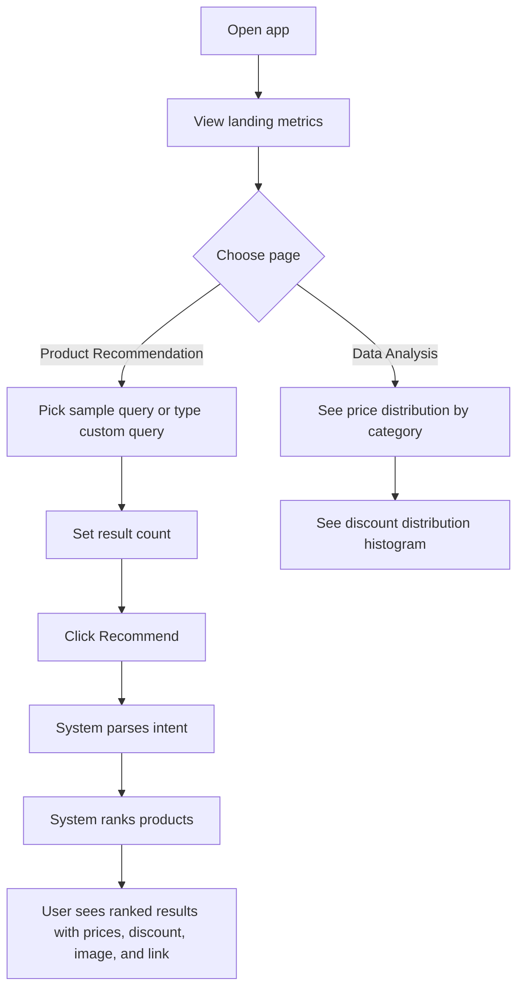

# ShopLens Product Recommendation System

This repository contains a Streamlit-based product recommendation app built on top of the Flipkart sample ecommerce dataset. The app lets a user type a natural-language shopping request, extracts shopping intent from that text, and ranks matching catalog products using a local search-and-scoring pipeline.

The current codebase is not a full ecommerce platform. It is a single-process data app with:

- a Streamlit frontend
- a local CSV dataset
- optional Gemini-based query understanding
- rule-based fallback intent extraction
- TF-IDF + cosine-similarity ranking
- simple exploratory charts

## What This Project Actually Does

Implemented behavior confirmed from the code:

- Loads `flipkart_com-ecommerce_sample.csv`
- Cleans and enriches product data
- Extracts:
  - primary category
  - readable category path
  - primary product image
  - coarse gender label (`Men`, `Women`, `Unisex`)
- Accepts natural-language shopping queries
- Parses intent using:
  - Gemini, if `GEMINI_API_KEY` is available
  - local regex/rule-based fallback otherwise
- Builds a TF-IDF search index over product text
- Scores products using a mixture of:
  - semantic similarity
  - product-type matching
  - category/style/attribute matching
  - color matching
  - gender matching
  - brand matching
  - lower-price preference
  - higher-discount preference
- Shows ranked product cards with:
  - image
  - product name
  - brand
  - category
  - gender
  - description snippet
  - retail price
  - discounted price
  - discount percentage
  - product link
- Provides a `Data Analysis` page with:
  - box plot of retail price across top categories
  - histogram of discount percentages

## What Is Not Implemented

The repo does **not** currently contain:

- a separate backend API service
- a database
- user accounts or authentication
- user profile storage
- recommendation history persistence
- collaborative filtering or user-to-user recommendations
- deep-learning recommendation models
- online training or model retraining jobs
- live Flipkart API integration
- add-to-cart, checkout, payment, or order tracking
- admin dashboard
- automated tests
- CI/CD pipeline
- containerization or deployment config
- monitoring, logging, or analytics infrastructure
- advanced filter UI for brand, category, price, discount, or gender
- explicit sort controls in the frontend

## Tech Stack

### Frontend

- Streamlit
- Custom CSS injected with `st.markdown(...)`
- Streamlit widgets:
  - sidebar radio
  - pills
  - text area
  - slider
  - button

There is no React, Vue, Angular, or separate HTML/JS frontend in this repo.

### Data and Logic

- Python
- Pandas for data loading and transformation
- `ast.literal_eval` for parsing serialized list/category fields in the dataset
- Regex-based NLP heuristics
- Scikit-learn `TfidfVectorizer`
- Scikit-learn `cosine_similarity`
- NumPy for numerical scoring
- `python-dotenv` for environment loading
- Optional `google-genai` integration for Gemini intent extraction

### Analytics and Visualization

- Matplotlib
- Seaborn

### Dataset

- `flipkart_com-ecommerce_sample.csv`
- Raw rows in file: `20,000`
- Rows after preprocessing: `19,922`
- Dropped during preprocessing: `78`
- Top-level categories after preprocessing: `262`

## Project Structure

```text
.
|-- app.py
|-- data_processing.py
|-- recommendation.py
|-- flipkart_com-ecommerce_sample.csv
|-- requirements.txt
`-- README.md
```

## File-by-File Breakdown

### `app.py`

Responsible for the Streamlit app shell.

- Sets the page config
- Applies the custom UI theme
- Loads the dataset
- Preprocesses the dataset
- Shows top-level metrics
- Switches between:
  - `Product Recommendation`
  - `Data Analysis`

### `data_processing.py`

Responsible for dataset preparation and analytics.

- `load_data(...)`
  - reads the CSV
  - handles common CSV read errors
- `extract_primary_category(...)`
  - parses the top-level category from the serialized category tree
- `extract_category_path(...)`
  - converts the category tree into a more readable path
- `extract_primary_image(...)`
  - pulls the first image URL from the serialized image list
- `determine_gender(...)`
  - infers `Men`, `Women`, or `Unisex` from product text
- `preprocess_data(...)`
  - creates enriched fields
  - selects the columns used by the recommender
  - drops rows missing key pricing/category data
- `display_data_analysis(...)`
  - renders the two charts

### `recommendation.py`

Responsible for query understanding, search indexing, scoring, and product rendering.

- Defines product synonym dictionaries and intent vocabulary
- Defines the `QueryIntent` dataclass
- Supports two intent extraction paths:
  - `_gemini_intent(...)`
  - `_fallback_intent(...)`
- Normalizes and enriches the catalog for search
- Builds a TF-IDF index over product text
- Scores and filters candidates in `recommend_products(...)`
- Renders result chips and product cards for Streamlit

## End-to-End Architecture



## User Flow



## Recommendation Flow in Plain English

When the user submits a query, the app tries to understand:

- product type
- occasion
- gender
- price ceiling
- budget intent
- brands
- attributes
- colors
- desired sort direction

Then it creates a search phrase and compares that phrase with a locally prepared text index built from:

- product name
- brand
- primary category
- category path
- gender
- first part of description

After the semantic similarity score is computed, the app adds heuristics:

- boost if the product type matches
- boost if occasion/style terms match
- boost if color terms match
- boost if gender matches
- boost if brand matches
- add price-awareness
- add discount-awareness

Finally, it applies light candidate filtering:

- budget cutoff if enough products fit
- budget-friendly trimming for low-price intent
- gender filtering if enough candidates remain
- strict occasion filtering if enough candidates remain

## Concrete Scenario Walkthrough

Example query:

```text
black office footwear for men under 1000
```

What the code extracts from this query:

- `product_type = shoe`
- `occasion = office`
- `gender = Men`
- `max_price = 1000`
- `colors = black`

What happens next:

1. The query is converted into a search phrase.
2. The catalog text index is searched with TF-IDF + cosine similarity.
3. Products that look like shoes get a strong score boost.
4. Black color matches receive an extra boost.
5. Men or unisex products are preferred.
6. If at least three products are within `Rs. 1000`, the candidate set is restricted to budget-fitting items.
7. The top scored products are returned and shown as cards.

Observed from a local code run, the app returns shoe/loafer/formal-footwear style matches around the `Rs. 999` range for this scenario, which is consistent with the implemented ranking logic.

## Current Features by Status

| Area | Status | Notes |
|---|---|---|
| Streamlit UI | Implemented | Styled, single-page app with sidebar navigation |
| Natural language query input | Implemented | Via text area and example pills |
| Gemini intent extraction | Implemented | Optional; requires `GEMINI_API_KEY` |
| Local fallback NLP | Implemented | Used when Gemini is unavailable |
| TF-IDF product retrieval | Implemented | Local search index over catalog text |
| Heuristic ranking layer | Implemented | Price, discount, gender, product, color, brand, attribute boosts |
| Product result cards | Implemented | Includes price, discount, image, description, link |
| Data analysis charts | Implemented | Two exploratory visualizations |
| Persistent user history | Not implemented | No storage layer |
| Personalized recommendations | Not implemented | No user behavior model |
| Training pipeline | Not implemented | No offline/online ML workflow |
| Automated tests | Not implemented | No `tests/` directory |
| API backend | Not implemented | Streamlit app only |
| Deployment automation | Not implemented | No Docker/CI config |

## Actual Dependencies

From `requirements.txt`:

- `pandas`
- `seaborn`
- `matplotlib`
- `python-dotenv`
- `streamlit`
- `scikit-learn`
- `google-genai`

## Setup

Install dependencies:

```bash
pip install -r requirements.txt
```

Optional `.env` file:

```bash
GEMINI_API_KEY=your-gemini-api-key
GEMINI_MODEL=gemini-2.5-flash
```

Run the app:

```bash
streamlit run app.py
```

## Notes and Limitations

- Gemini is only used for query understanding, not for ranking the full catalog.
- If Gemini is unavailable, the app still works through the local fallback parser.
- Gender inference is heuristic and text-based, so it can be noisy.
- Category and image parsing depend on the dataset using serialized Python-like list strings.
- The recommender is content-based, not collaborative.
- Results come only from the local CSV file, not from a live product source.
- Some products have missing brand information.
- Some result images can be absent or broken because the app relies on dataset URLs.

## Troubleshooting

If you see Matplotlib cache warnings in restricted environments, set a writable config directory before running:

```bash
export MPLCONFIGDIR=/tmp/matplotlib
streamlit run app.py
```

## Recommended Next Improvements

If this project is being continued, the most valuable next steps are:

1. Add automated tests for preprocessing, intent parsing, and ranking.
2. Move ranking logic into a more modular service layer.
3. Add explicit frontend filters and sorting controls.
4. Add evaluation metrics for recommendation quality.
5. Add persistent query logging and feedback collection.
6. Add deployment assets such as Docker and CI workflows.
